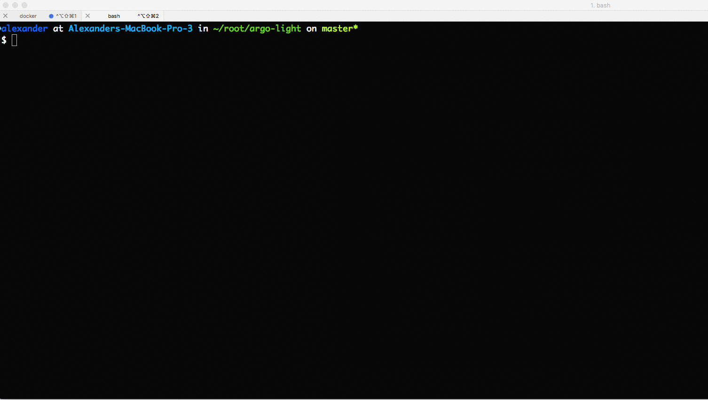

# argo-light

Argo-light is lightweight workflow engine implementation compatible with [Argo](https://github.com/argoproj/argo) YAML. Argo-light executes workflow defined using [Argo YAML](https://argoproj.github.io/argo-site/docs/yaml/dsl_reference_intro.html) using Docker or Kubernetes. It exposes same APIs as [Argo](https://github.com/argoproj/argo) so project is
compatible with [Argo Dev CLI](https://argoproj.github.io/argo-site/docs/dev-cli-reference.html) and Argo UI.

## Argo-light is in active development state.

Several features or argo workflow engine are not yet supported, engine is not fully tested and might crash but early testing/contributions are very very welcome.

- [x] ~~Kubernetes integration~~
- [ ] [Dynamic fixtures](https://argoproj.github.io/argo-site/docs/yaml/fixture_template.html)
- [ ] unit/e2e tests


## Why?

Argo-light might be used to debug Argo workflows locally on your laptop or to quicky get experience of [Argo](https://github.com/argoproj/argo) without full cluster deployment.

## Deploy it:

1. Run argo-light locally using docker as workflow step executor:

```
docker run --rm -p 8080:8080  -v /var/run/docker.sock:/var/run/docker.sock -dt docker.io/alexmt/argo-light node /app/dist/main.js
```

2. Run argo-light locally using remote kubernetes cluster as workflow step executor:

```
docker run --rm -p 8080:8080 -v <path-to-your-kube-config>:/cluster.conf -it docker.io/alexmt/argo-light node /app/dist/main.js --engine kubernetes --config /cluster.conf
```

3. Deploy argo-light to your kubernetes cluster using same cluster as workflow step executor:

```
git clone git@github.com:alexmt/argo-light.git && cd argo-light && kubectl create -f argo-light.yaml
```

## Try it:

Install and configure [Argo Dev CLI](https://argoproj.github.io/argo-site/docs/dev-cli-reference.html) and build argo-light using argo-light :

```
argo job submit checkout-build --config mini --local
```


